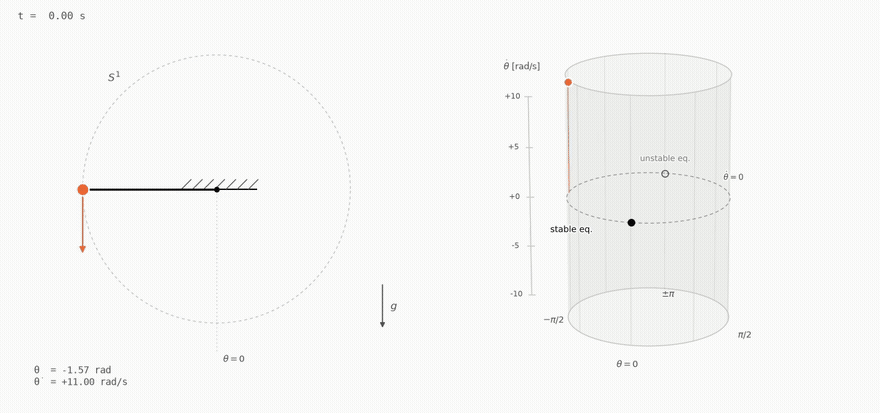
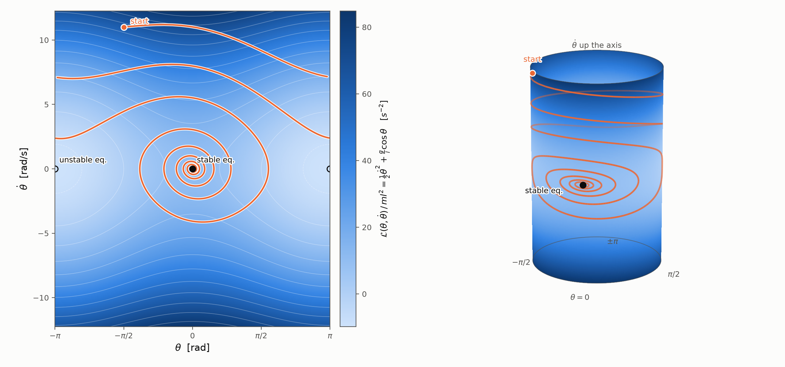
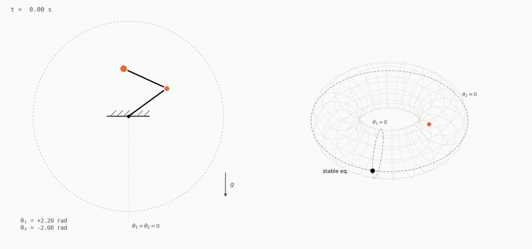
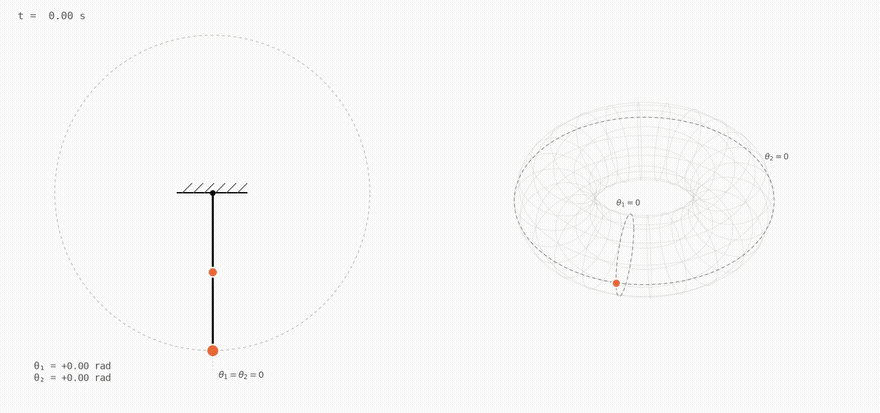
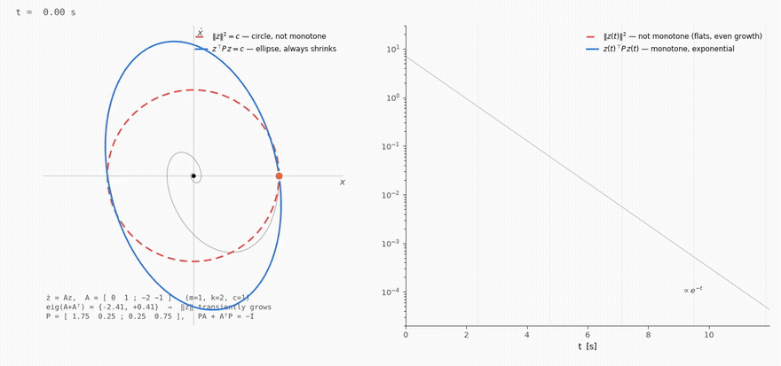
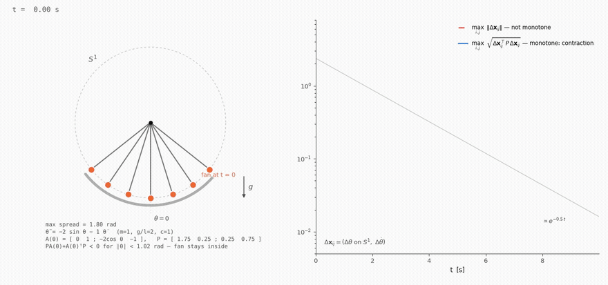
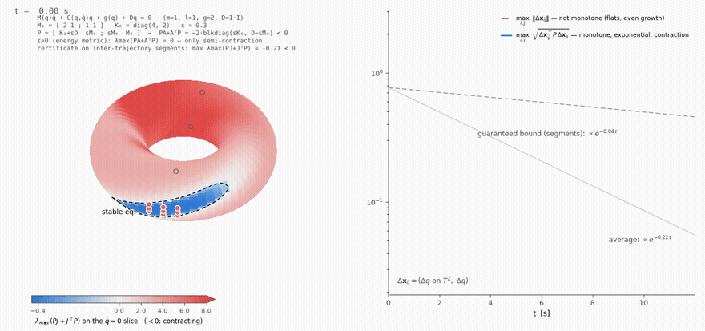

# Contraction Theory Examples

Animated examples for contraction theory and geometric mechanics. Each example
lives in its own package under `src/contraction_examples/` and renders its
media (MP4 / GIF / PNG) into `media/` via a small CLI.

## Example 1 — a pendulum and its tangent-bundle cylinder

A damped simple pendulum (left) next to the geometric picture of its dynamics
(right): the configuration is an angle θ on the circle S¹, so the full state
(θ, θ̇) lives on the tangent bundle

$$TS^1 \cong S^1 \times \mathbb{R},$$

which is a cylinder — θ wraps around it, θ̇ runs along its axis. The pendulum
starts with enough velocity to go over the top a few times (the trajectory
*wraps* around the cylinder — no ±π jump, which is exactly why the cylinder and
not the plane is the right state space), then damping captures it and the
trajectory spirals into the stable equilibrium (θ, θ̇) = (0, 0).



Summary figure (full trajectory, pendulum shown mid-swing):
[`media/pendulum_cylinder.png`](media/pendulum_cylinder.png) · video:
[`media/pendulum_cylinder.mp4`](media/pendulum_cylinder.mp4)

### Model

$$\ddot{\theta} = -\frac{g}{L}\sin\theta - c\,\dot{\theta},
\qquad g = 9.81\ \mathrm{m/s^2},\ L = 1\ \mathrm{m},\ c = 0.55\ \mathrm{s^{-1}},$$

integrated with `scipy.integrate.solve_ivp` (DOP853) from
(θ₀, θ̇₀) = (−π/2, 11 rad/s).

### The Lagrangian on the tangent bundle

The pendulum's Lagrangian (per unit mass and rod length)

$$\mathcal{L}(\theta, \dot{\theta})/ml^2 = \tfrac{1}{2}\dot{\theta}^2 + \frac{g}{l}\cos\theta$$

as a colormap over the state space — flat (θ, θ̇) chart on the left, painted
onto the cylinder on the right — with the same damped trajectory drawn on top
of it. On the flat chart the trajectory jumps at the ±π seam; on the cylinder
it just wraps.



### Run it

```sh
uv sync
uv run pendulum-cylinder            # renders PNG + MP4 + GIF into media/
uv run pendulum-cylinder --no-video # summary PNG only (fast)
uv run pendulum-lagrangian          # Lagrangian colormap + trajectory PNG
```

Useful flags for `pendulum-cylinder`: `--duration`, `--fps`, `--damping`,
`--theta0`, `--theta-dot0`, `--t-snap` (pendulum pose in the summary PNG),
`--outdir`. For `pendulum-lagrangian`: the same simulation flags plus
`--no-trajectory` for the bare colormap. See `--help` on either command.

## Example 2 — a double pendulum and its configuration torus

A planar double pendulum in absolute angles (θ₁, θ₂), each measured from the
downward vertical. The configuration space is the torus

$$T^2 \cong S^1 \times S^1,$$

drawn as a wireframe: θ₁ runs around the main ring, θ₂ around the tube. The
undamped chaotic motion (energy is conserved to ~1e-9 by the DOP853
integrator) makes the configuration point wind around both directions of the
torus, leaving a persistent trace with the recent past drawn brighter.



Summary figure: [`media/double_pendulum_torus.png`](media/double_pendulum_torus.png)
· video: [`media/double_pendulum_torus.mp4`](media/double_pendulum_torus.mp4)

```sh
uv run double-pendulum-torus            # renders PNG + MP4 + GIF into media/
uv run double-pendulum-torus --no-video # summary PNG only (fast)
```

Flags: `--duration`, `--fps`, `--theta1-0`, `--theta2-0`, `--theta1-dot0`,
`--theta2-dot0`, `--damping1`, `--damping2`, `--t-snap`, `--outdir`.

### Linear flow — a straight line on the torus

The same two-bar linkage with gravity off and each joint turning at a
constant rate ω₁, ω₂: the configuration traces a *straight line* in the flat
torus coordinates, (θ₁, θ₂) = (θ₁₀ + ω₁t, θ₂₀ + ω₂t) — the geodesic flow of
the flat metric on T². With ω₂/ω₁ = φ (the golden ratio, default) the line
never closes and fills the torus densely; a rational ratio closes into a
torus knot/link curve.



Summary figure: [`media/torus_linear_flow.png`](media/torus_linear_flow.png)
· video: [`media/torus_linear_flow.mp4`](media/torus_linear_flow.mp4)

```sh
uv run torus-linear-flow                      # golden-ratio winding
uv run torus-linear-flow --omega2 1.5         # closes into a (2,3) curve
uv run torus-linear-flow --true-dynamics      # real zero-g double pendulum
```

Physics note: for the *actual* zero-gravity double pendulum, constant joint
rates solve the equations of motion exactly only when ω₁ = ω₂ (the inertial
coupling term m₂l₁l₂ sin(θ₁−θ₂)·θ̇² cancels); otherwise the coupling bends
the line. The default drives the joints kinematically (two decoupled
rotors); `--true-dynamics` integrates the real thing from the same initial
velocities so you can see the difference.

## Example 3 — contraction needs a metric: the mass-spring-damper

The mass-spring-damper **ẋ** = A**x**, with state vector **x** = (x, ẋ) and
A = [[0, 1], [−k, −c]] (m = 1, k = 2, c = 1 by default), is exponentially
stable — eig(A) = −½ ± (√7/2)i — yet it is **not** contracting in the
Euclidean metric. The symmetric part A + Aᵀ = [[0, −1], [−1, −2]] is
*indefinite*, eig = −1 ± √2 ≈ {+0.41, −2.41}, so

$$\tfrac{d}{dt}\|\delta \mathbf{x}\|^2 = \delta \mathbf{x}^\top (A + A^\top)\,\delta \mathbf{x}$$

is zero at every turning point and **positive** on part of every
oscillation: the Euclidean norm of a perturbation transiently *grows*.
Solving the Lyapunov equation PA + AᵀP = −I (done in
[`metrics.py`](src/contraction_examples/mass_spring_damper/metrics.py) via
`scipy.linalg.solve_continuous_lyapunov`) gives
P = [[7/4, 1/4], [1/4, 3/4]], and in the weighted norm **x**ᵀP**x** the same
flow contracts at every instant: d/dt (**x**ᵀP**x**) = −‖**x**‖².

The animation shows exactly where P lives — in the **shape of the level
sets**. The Euclidean circle through the current state stalls and even
expands as the spiral crosses it, while the tilted P-ellipse shrinks
monotonically; on the log-scale panel ‖**x**‖² wobbles against the
exponential envelope (flat or rising between turning points) while
**x**ᵀP**x** is a clean exponential.



Summary figure: [`media/mass_spring_damper.png`](media/mass_spring_damper.png)
· video: [`media/mass_spring_damper.mp4`](media/mass_spring_damper.mp4)

```sh
uv run mass-spring-damper            # renders PNG + MP4 + GIF into media/
uv run mass-spring-damper --no-video # summary PNG only (fast)
```

Flags: `--k`, `--c` (try `--k 1` for the classic semi-definite case where
the norm merely stalls), `--duration`, `--fps`, `--x0`, `--xdot0`,
`--t-snap`, `--outdir`.

## Example 4 — contraction on the circle: a fan of pendulums

The damped pendulum θ̈ = −2 sin θ − θ̇ (m = 1, g/l = 2, c = 1) linearizes at
the hanging equilibrium to **exactly** the A of Example 3, so the same
Lyapunov metric P = [[7/4, 1/4], [1/4, 3/4]] applies — now on the
configuration manifold S¹. The state-dependent Jacobian is
A(θ) = [[0, 1], [−2 cos θ, −1]], and the fixed metric P contracts wherever

$$P A(\theta) + A(\theta)^\top P \prec 0 \quad\Longleftrightarrow\quad \cos\theta > \tfrac{11 - 2\sqrt{10}}{9} \approx 0.52,$$

i.e. |θ| < 1.02 rad. A fan of seven pendulums released inside that region
(θ₀ ∈ [−0.9, 0.9]) therefore contracts onto a single motion: the maximal
pairwise P-distance (with Δθ measured on S¹) decreases **monotonically**,
while the Euclidean distance between the same trajectories transiently
grows — the same metric story as Example 3, transported to a manifold.



Summary figure: [`media/pendulum_contraction_s1.png`](media/pendulum_contraction_s1.png)
· video: [`media/pendulum_contraction_s1.mp4`](media/pendulum_contraction_s1.mp4)

```sh
uv run pendulum-contraction            # renders PNG + MP4 + GIF into media/
uv run pendulum-contraction --no-video # summary PNG only (fast)
```

Flags: `--g-over-l`, `--c`, `--spread` (initial fan half-width; a warning is
printed if it exceeds the P-contraction region), `--n`, `--duration`,
`--fps`, `--t-snap`, `--outdir`.

## Example 5 — contraction on the torus: the double pendulum and its mass-matrix metric

The damped double pendulum M(q)q̈ + C(q, q̇)q̇ + g(q) + Dq̇ = 0 lives on the
configuration torus T². **Is the contraction metric the mass matrix?**
Almost: M(q) is the kinetic-energy Riemannian metric on T², and it is the
*velocity block* of the contraction metric — but by itself it only gives
semi-contraction: the energy metric diag(K₀, M₀) has
λ_max(PA + AᵀP) = 0 (dissipation acts only through δq̇, the same stall as
Example 3's circle). The cross-term repair, in its **state-dependent**
form used here, puts the actual mass matrix in the velocity block:

$$P(q) = \begin{bmatrix} K_0 + \varepsilon D & \varepsilon M(q) \\ \varepsilon M(q) & M(q) \end{bmatrix},$$

and because the metric now varies along the flow, the contraction
condition acquires the metric-rate term:

$$\dot{P} + P J + J^\top P \prec 0, \qquad \dot{P} = \textstyle\sum_k \frac{\partial P}{\partial q_k}\,\dot{q}_k,$$

with J the state Jacobian (Ṗ vanishes identically on the q̇ = 0 slice,
which is what the animation paints on the torus: blue island =
contracting, dashed line = zero contour). Distances are measured as
segment integrals of √(δᵀP(γ)δ), and the certificate is checked along all
inter-trajectory *segments* — that is what the finite-distance decay
proof integrates over. The max pairwise P-distance then decays
monotonically while the Euclidean one transiently grows.

The constant-chart variant (M(q) frozen at M₀, `--constant-metric`)
satisfies the exact linearization identity
PA + AᵀP = −2·blkdiag(εK₀, D − εM₀), and the comparison is the point of
the defaults: at the default fan (±0.18 rad) the state-dependent P(q) is
certified with margin −0.31 while the constant P₀ **fails** for every ε
of the family — tracking M(q) roughly doubles the certified margin and
rate. Two honest caveats remain: contraction on T² is necessarily local
(four equilibria — one stable, three unstable open circles — so no metric
contracts the whole torus), and the certified region is still finite
(`--spread` beyond it prints a warning).



Summary figure: [`media/double_pendulum_contraction.png`](media/double_pendulum_contraction.png)
· video: [`media/double_pendulum_contraction.mp4`](media/double_pendulum_contraction.mp4)
· full derivation: [`docs/contraction_math.md`](docs/contraction_math.md)

```sh
uv run double-pendulum-contraction            # analysis + PNG + MP4 + GIF
uv run double-pendulum-contraction --no-video # analysis + summary PNG only
```

Flags: `--eps` (cross-term weight; rejected if P(q) or D − εM₀ lose
definiteness), `--constant-metric` (freeze M(q) at M₀ for comparison),
`--spread`, `--gravity`, `--damping`, `--duration`, `--fps`, `--t-snap`,
`--outdir`.

## Repository layout

```
├── pyproject.toml                     # uv project; console scripts (see [project.scripts])
├── media/                             # rendered outputs, kept in the repo
└── src/contraction_examples/
    ├── style.py                       # shared palette + label conventions
    ├── media_utils.py                 # shared MP4/GIF writers (bundled ffmpeg)
    ├── mass_spring_damper/
    │   ├── dynamics.py                # ẋ = Ax, A = [[0,1],[−k,−c]]
    │   ├── metrics.py                 # Lyapunov P, quadratic forms, level sets
    │   └── animate.py                 # phase-plane + norms figure, CLI
    ├── pendulum_contraction/
    │   └── animate.py                 # fan of pendulums on S¹ + P-distance, CLI
    ├── double_pendulum_contraction/
    │   ├── metric.py                  # state-dependent P(q) from M(q), K₀, D; certificates
    │   └── animate.py                 # painted torus + P-distance panel, CLI
    ├── pendulum_cylinder/
    │   ├── dynamics.py                # pendulum ODE + integration
    │   ├── cylinder.py                # embedding of TS¹ ≅ S¹ × ℝ into R³
    │   ├── animate.py                 # two-panel figure, animation, CLI
    │   └── lagrangian.py              # Lagrangian colormap on TS¹, CLI
    └── double_pendulum_torus/
        ├── dynamics.py                # double pendulum ODE + energy + integration
        ├── torus.py                   # embedding of T² ≅ S¹ × S¹ into R³
        ├── animate.py                 # two-panel figure, animation, CLI
        └── linear_flow.py             # straight-line (geodesic) flow on T², CLI
```

Conventions for adding a new example: put the model in its own package with a
`dynamics.py` (simulation only, no plotting), keep geometry/embedding helpers
separate from figure code, reuse `style.py` (palette) and `media_utils.py`
(MP4/GIF writers), expose a console script in `pyproject.toml`, and render
into `media/`.

## Requirements

- [uv](https://docs.astral.sh/uv/) (Python 3.12 is pinned via `.python-version`)
- No system ffmpeg needed — the MP4/GIF are written with the bundled
  `imageio-ffmpeg` binary.
